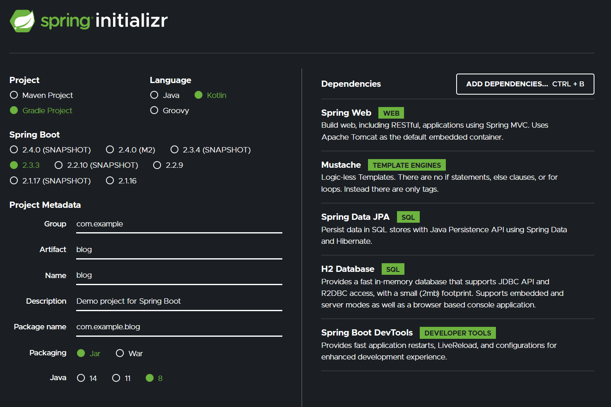

# Spring Boot + Kotlin + Gradle + jUnit5

## Spring Initializr

[Spring Initializr](https://start.spring.io/) から雛形生成。  
 

  

Project:
  
 * Gradle Project

Language:  
  
 * Kotlin
 
Spring Boot:  

 * 2.x

Project Metadata

 * Group: com.example
 * Artifact: blog
 * Name: blog
 * Description: Demo project for Spring Boot
 * Package name: com.example.blog
 * Packaging: Jar
 * Java: 8

Dependencies:  

* Spring Web Web
* Mustache Template Engines
* Spring Data JPA SQL
* H2 Database SQL
* Spring Boot DevTools Developer Tools

:link: [Spring Initializr - share](https://start.spring.io/#!type=gradle-project&language=kotlin&platformVersion=2.3.3.RELEASE&packaging=jar&jvmVersion=1.8&groupId=com.example&artifactId=blog&name=blog&description=Demo%20project%20for%20Spring%20Boot&packageName=com.example.blog&dependencies=web,mustache,data-jpa,h2,devtools)

